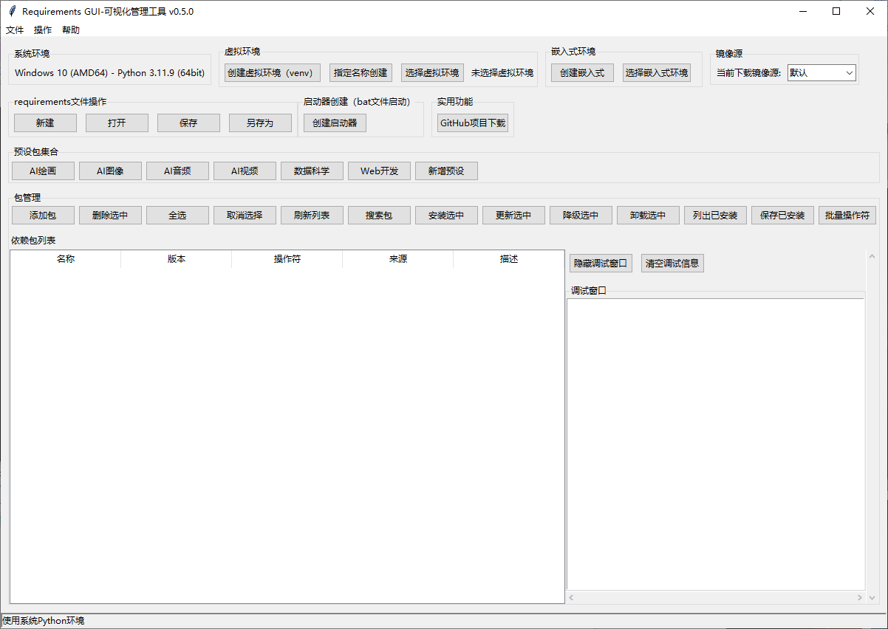

# Requirements GUI-可视化管理工具 使用示例

## 基本操作

### 1. 创建新的requirements文件
1. 启动程序：`python requirements_gui.py`
2. 点击"新建"按钮
3. 点击"添加包"按钮，输入包名如`requests`
4. 点击"保存"按钮，保存为`requirements.txt`

### 2. 编辑现有的requirements文件
1. 启动程序
2. 点击"打开"按钮，选择现有的requirements文件
3. 双击任意包行进行编辑
4. 点击"保存"按钮保存更改

### 3. 安装包
1. 打开或创建一个requirements文件
2. 选择要安装的包（按住Ctrl可多选）
3. 点击"安装选中"按钮
4. 或者点击"安装所有包"安装所有依赖

### 4. 生成当前环境的requirements
1. 点击菜单栏"操作" -> "生成当前环境的requirements"
2. 程序会自动检测当前环境中安装的所有包
3. 可以选择保存到文件

## 高级功能

### 虚拟环境管理
1. 点击"创建虚拟环境"按钮
2. 选择虚拟环境创建位置，程序会自动创建名为`venv`的虚拟环境
3. 或者点击"选择虚拟环境"按钮，选择已有的虚拟环境目录
4. 在虚拟环境中进行包管理操作，不会影响系统Python环境

### 嵌入式环境管理
1. 点击"创建嵌入式"按钮
2. 选择嵌入式环境创建位置，程序会自动创建名为`embed_env`的嵌入式环境
3. 或者点击"选择嵌入式环境"按钮，选择已有的嵌入式Python环境目录
4. 在嵌入式环境中进行包管理操作，适用于嵌入式Python发行版

### 镜像源切换
1. 在界面顶部的镜像源下拉菜单中选择合适的镜像源
2. 支持的镜像源包括：默认、官方、清华、阿里、豆瓣、中科大
3. 切换镜像源后，所有pip操作都会使用选定的镜像源

### 预设包集合
1. 在"预设包集合"区域点击相应的按钮
2. 支持的预设包集合包括：AI绘画、AI图像、AI音频、AI视频、数据科学、Web开发
3. 点击按钮后，相应的包会自动添加到当前requirements列表中

### 包版本管理
- 支持多种版本操作符：`==`, `>=`, `<=`, `>`, `<`, `!=`, `~=`
- 可以为每个包指定特定的版本要求

### 包来源管理
- PyPI：默认包来源
- Git：支持从Git仓库安装包（需要手动编辑requirements文件）
- 本地：支持从本地路径安装包（需要手动编辑requirements文件）

## 高级功能

## 常见问题解答

### Q: 如何在Python 3.7及以下版本中使用？
A: 取消注释requirements.txt中的`importlib-metadata`行，然后运行：
```bash
pip install -r requirements.txt
```

### Q: 如何从命令行安装包？
A: 除了使用GUI界面，还可以直接使用pip命令：
```bash
pip install -r requirements.txt
```

### Q: 如何导出当前环境的所有包？
A: 使用pip freeze命令：
```bash
pip freeze > requirements.txt
```

## 快捷键
- Enter：确认对话框
- Escape：取消对话框
- 双击包名：编辑包信息

## 截图

*主界面展示包列表*


*添加包对话框*